# Agentic Coding Tools: The Current Landscape
## A Guide for Newcomers to AI-Powered Development

  
    Press Space for next page <carbon:arrow-right class="inline"/>
  

---

# About This Presentation

**Speaker**: Based on insights from Armen's analysis
**Duration**: 30 minutes
**Audience**: Developers new to agentic programming
**Objective**: Understanding the current state and challenges of AI coding tools

---

# What Are Agentic Coding Tools?

## The Basic Concept

- **LLM + Tool Loop**: AI models that can call tools and iterate
- **Autonomous Code Generation**: Write, test, and refine code independently
- **Command Line Focus**: Most tools moving toward CLI interfaces

## Why "Agents"?

- Term is somewhat controversial but widely adopted
- Not true agents in the AI research sense
- More accurately: "LLM tool loops for coding"

---

# The Current Explosion (Since May 2024)

## The Numbers
- **30+ different CLI coding tools** currently available
- New tools launching daily
- Massive investor and developer interest

## The Drivers
- Improved foundation models (Claude, GPT, Gemini)
- Better tool calling capabilities
- Proven value for certain coding workflows

---

# Types of Agentic Coding Tools

## 1. IDE Extensions
- **Examples**: GitHub Copilot, Cursor
- **Capabilities**: Autocomplete + basic coding loops
- **Note**: Cursor now also has CLI agents

## 2. Standalone CLI Tools
- **Examples**: Claude Code, Aider, Devon
- **Capabilities**: Full system access, complex multi-file operations
- **Environment**: Run directly on your machine

## 3. Web-Based Tools
- **Examples**: v0, Bolt, Replit Agent
- **Focus**: UI/interface creation
- **Limitations**: More constrained than CLI tools

## 4. Platform-Integrated
- **Examples**: Devon (now acquired), GitHub integration tools
- **Deployment**: Remote servers, background agents

---

# How These Tools Actually Work

## Core Tool Set

1. **File Reading**: Access and understand codebases
2. **Code Search**: grep, ripgrep for finding relevant code
3. **File Editing**: Modify existing files or create new ones
4. **Command Execution**: Run tests, compilers, build tools
5. **Web Search**: (Some tools) Access documentation

## The Tool Loop Process

---

# The Model-Tool Binding Problem

## Key Insight: Not All Models Are Equal

- **Best performing tools** have models trained on their specific tool set
- **Example**: Claude models trained on bash, text editor, web search tools
- **Problem**: Generic tools may not work optimally with all models

## Evidence

- GPT-4 frequently calls non-existent "search" tool
- Early GPT-5 access tools outperformed day-one implementations
- Tool naming and prompting matter significantly

<strong>⚠️ Warning:</strong> Model-tool compatibility is crucial for good results

---

# Model Landscape

## Production-Ready Models
- **Anthropic**: Claude 3.5 Sonnet, Opus
- **OpenAI**: GPT-4, GPT-5
- **Google**: Gemini Pro
- **xAI**: Grok (promising but inconsistent)

## Open Source Options
- **QwQ Coder**: Capable tool calling
- **Qwen**: Multiple sizes available
- **Llama**: Various fine-tuned versions

## The Platform Problem
- Performance varies wildly between providers (OpenRouter vs direct API)
- Local vs hosted can behave differently
- "Slot machine" experience with some platforms

<strong>💡 Tip:</strong> Test the same model on different platforms

---

# Quality and Safety Considerations

## Pre/Post-Flight Checks
**Example**: Claude Code
- **Pre-flight**: Haiku model creates task description
- **Post-flight**: Haiku validates tool usage safety
- **Result**: Reduces dangerous operations

## Common Problems
- Tools getting stuck in infinite loops
- Inappropriate command execution
- Working outside project boundaries
- Network request failures without recovery

<h3 class="text-red-800 font-bold text-xl">⚠️ YOLO Mode Warning</h3>

Not all tools are safe to run with full permissions!

---

# The Evaluation Challenge

## Why It's Hard to Compare Tools

1. **Too many variables**: Model, tool setup, prompting, safety checks
2. **Benchmark gaming**: SWE-bench optimization vs real-world performance
3. **Cost complexity**: Cheaper tokens ≠ lower total cost
4. **Efficiency differences**: Token usage patterns vary dramatically

## Real-World Factors
- **User Experience**: Interface quality affects results
- **Workflow Integration**: How well it fits your development process
- **Reliability**: Consistency over multiple runs
- **Speed vs Quality**: Tradeoffs in iteration patterns

---

# Cost Considerations

## It's Complicated

- **Per-token pricing** doesn't tell the full story
- **Iteration patterns** vary between models
- **GPT-5**: Cheaper per token but more tokens used
- **Claude**: More expensive per token but more efficient loops

## Hidden Costs
- **Time to first token**: Affects perceived speed
- **Failed iterations**: Wasted compute on stuck agents
- **Context switching**: Mental overhead of tool interactions

<strong>💰 Key Point:</strong> Total cost = (tokens × price) + (time × developer_rate) + failure_cost

---

# Practical Use Cases

## What Works Well Today ✅
1. **Prototype Tools**: Quick debugging utilities, data analysis scripts
2. **Code Modernization**: Updating syntax, fixing deprecated APIs
3. **Test Generation**: Creating comprehensive test suites
4. **Documentation**: Code comments, README generation

## What's Still Challenging ❌
- **Large refactoring**: Cross-system architectural changes
- **Performance optimization**: Subtle algorithmic improvements
- **Complex business logic**: Domain-specific requirements

```mermaid
graph LR
    A[Simple Tasks] --> B[Medium Complexity] --> C[Complex Architecture]
    A -.->|Works Great| D[✅ High Success]
    B -.->|Mixed Results| E[⚠️ Variable Success]
    C -.->|Still Hard| F[❌ Limited Success]
```

---

# The Startup Ecosystem

## Current State
- **Massive funding** for AI coding tools
- **Too many similar products** (30+ CLI tools)
- **Consolidation inevitable**: Market can't support all current players

## Evaluation Difficulty
- **Twitter hype ≠ reality**: Social media not reliable for quality assessment
- **Benchmark limitations**: Standard metrics don't capture real usage
- **Personal preference**: UX and workflow fit matter more than benchmarks

---

# Best Practices for Getting Started

## Choosing a Tool
1. **Start with established options**: Claude Code, Cursor, or Aider
2. **Match model to tool**: Use tools with their preferred models
3. **Understand safety features**: Know what protections are in place
4. **Test on non-critical projects**: Don't risk important codebases

## Setting Expectations
- **Iteration required**: Rarely perfect on first try
- **Supervision needed**: Review all code changes
- **Backup everything**: Version control is essential
- **Start small**: Simple tasks before complex projects

---

# Looking Forward

## Short-Term Trends
- **Model improvements**: Better tool calling and reasoning
- **Tool standardization**: MCP and similar protocols
- **Cost optimization**: More efficient inference patterns
- **Safety improvements**: Better sandboxing and validation

## Questions to Watch
- **Consolidation timeline**: How many tools will survive?
- **Enterprise adoption**: Security and compliance challenges
- **Integration patterns**: How tools fit into existing workflows
- **Performance plateau**: Are we hitting capability limits?

---

# Key Takeaways

## For Newcomers
1. **The technology works** but requires understanding and patience
2. **Tool choice matters** more than you might expect
3. **Model-tool compatibility** is crucial for good results
4. **Evaluation is difficult** - trust practical experience over hype

## Current Reality
- **Explosion of options** makes choice overwhelming
- **Quality varies significantly** between tools and models
- **Real value exists** but mostly for specific use cases
- **The field is still evolving** rapidly

---

# Resources for Further Learning

## Documentation
- **Anthropic**: Claude model tool documentation
- **OpenAI**: GPT model capabilities and limitations
- **Tool websites**: Each major tool's getting started guide

## Practical Steps
1. **Try multiple tools** with the same task
2. **Join community discussions** (but take with grain of salt)
3. **Build your own evaluation criteria** based on your needs
4. **Share experiences** with your team

---

# Q&A

## Questions?

Remember: The field is evolving rapidly. What's true today may change in weeks or months.

Focus on understanding principles rather than memorizing specific tool features.

---

# Thank You

<strong>Key Message</strong>: Agentic coding tools offer real value but require thoughtful adoption and realistic expectations.

<strong>Next Steps</strong>: Start experimenting with simple tasks on non-critical projects to build understanding and intuition.

Questions? Let's chat after the talk! 🚀

