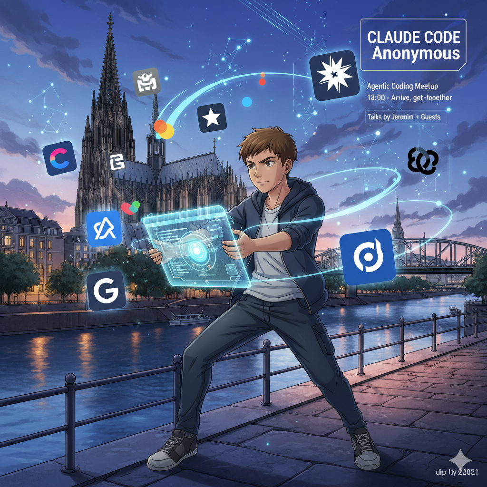
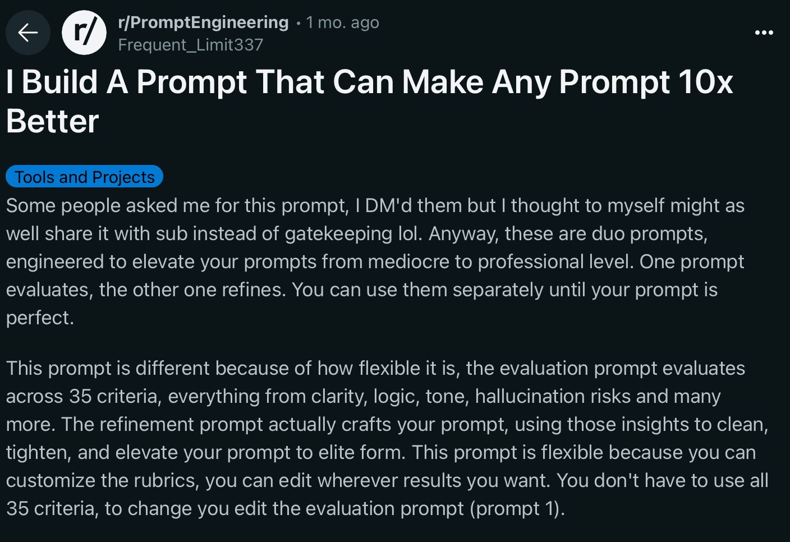

# Claude Code Anonymous
## Cologne Meetup

*Agentic Coding: Real Talk*

  
    Press Space for next slide <carbon:arrow-right class="inline"/>
  

---

# Intent → Impact
## My Agentic Evolution

*A journey from tab completion to building what matters*

  
I don't build faster.

  
I build what matters, faster.

---
layout: center
class: text-center
---

# The Motivation 💡

<v-click>

My wife was inspired by **Cozama** at Startplatz

</v-click>

<v-click>

She dreamed of having a similar tool for herself
*(A personal version of what Cozama offered teams)*

</v-click>

<v-click>

That dream became my mission

</v-click>

<v-click>

<strong>Quick show of hands:</strong> Who here has had that moment where you actually trusted an AI coding tool to do something important?

</v-click>

---

# Act I: The Stone Age
## Tab Completion Era

<v-clicks>

- **1+ year**: GitHub Copilot, Cursor tab completion
- **Cursor cmd+i**: Never trusted it, poor results
- **Workflow**: Ask models → copy code manually
- **The feeling**: "I'm missing something bigger..."

</v-clicks>

<v-click>

<strong>Maybe the LLMs just weren't ready yet</strong>

</v-click>

---

# Act II: The Bronze Age
## Agent Proliferation & Hype

<v-clicks>

**First breakthrough**: Claude Code on CI issues ✅

**Then came the Reddit/X hype explosion**:
- Individual agents for each task
- RIPER 5 (research, innovate, plan, execute, review)
- Multiple Claude instances in tmux
- Complex git worktree setups
- "I Build A Prompt That Can Make Any Prompt 10x Better"

</v-clicks>

<v-click>

<strong>Good ideas. None really took off.</strong>

</v-click>

---

# The Reality Check
## What Actually Happened

<v-clicks>

**Reality check**: I tried 6 design systems for Chaodinator in parallel tmux sessions with git worktrees. Looked cool, burned credits fast, projects stalled midway. Recovery was impossible.

*Back to minimalistic HTML, one design at a time.*

</v-clicks>

<v-click>

</v-click>

<v-click>

<strong>Be honest:</strong> How many of you have fallen down at least one of these Reddit AI rabbit holes? Don't worry, we've all been there.

</v-click>

---

# Act III: The Iron Age
## The Real Breakthrough

<v-click>

## **Sonnet 4 arrived** 🚀
*Immediate, dramatic quality leap*

</v-click>

<v-click>

## **SpecStory Discovery** 📝
*"Preserve intent: Automatically capture AI conversations in Markdown"*

- Search old conversations
- **Show colleagues how PRs were created**
- Transparency → Learning

</v-click>

---

# The SpecFlow Revolution

<v-clicks>

"Intent is the new source code"

**SpecFlow Structure**:
- `brainstorm.md` - Raw ideas
- `spec.md` - Crystal clear requirements
- `tasks.md` - Actionable steps

**Result**: Build the RIGHT products, not just products

</v-clicks>

<v-click>

<strong>Chaodinator.com</strong>: Vague idea → Crystal clear in hours

</v-click>

---

# The Clean Context Protocol

<v-clicks>

## Context Management = Everything

- **AGENTS.md** & **CLAUDE.md** for general themes
- **New session** for each problem
- **Maximum capacity** for models = maximum results

## The 4AM Marathon Philosophy

**Not a struggle.** ***The goal.***

Flow state with focused, iterative sessions.

</v-clicks>

<v-click>

Convention over Configuration

Rails + Agents = Perfect Marriage

</v-click>

<v-click>

<strong>Raise your hand if:</strong> You've ever had a coding session that felt like pure flow - where time just disappeared. That's what we're chasing.

</v-click>

---

# "Multi-Agent Orchestration"

## **Claude** 🎯
<v-clicks>

- Planning & development
- Opus 4.1 planning mode
- General problem solving

</v-clicks>

## **Codex** ⚡
<v-clicks>

- Reviews & refinement
- No-nonsense execution
- Critical code paths

</v-clicks>

## **Gemini** 🧠
<v-clicks>

- Codebase analysis
- Marketing strategy
- SEO & copy optimization

</v-clicks>

<v-click>

<strong>My Workflow</strong>: Claude plans → Codex reviews → Ping-pong iterations

</v-click>

---

# Act IV: Scaling the Methodology
## From Personal Workflow to System

<v-click>

The SpecFlow approach works for individuals...

What if we systematized it for teams?

</v-click>

<v-clicks>

### **The Individual Pattern**
- `brainstorm.md` → Raw thoughts
- `spec.md` → Clear requirements
- `tasks.md` → Actionable steps
- Clean context + focused sessions
- Rails convention over configuration

### **The Systematic Approach**
- **Omakase Philosophy**: Opinionated defaults
- **Convention-Driven**: Less decisions = more focus
- **Intent-Preserved**: Every choice documented
- **Iterative Refinement**: Build → Learn → Improve
- **Context-Aware**: Right tool, right job

**Result**: What took weeks now takes hours - not just for me, but for any builder

</v-clicks>

---
layout: center
class: text-center
---

# The Core Philosophy

<v-clicks>

"I don't build faster"

"I build what matters, faster"

  

    
Intent is the new source code

  

  

    
Clean context beats complexity

  

  

    
4AM marathons = Flow state

  

  

    
Convention over configuration

  

</v-clicks>

---
layout: center
class: text-center
---

# The Beauty of Agentic Development

<v-click>

There's no one right way

</v-click>

<v-click>

Find what works for you

</v-click>

<v-click>

<strong>Before I wrap up:</strong> What's the one thing you're working on right now that actually matters to you? Not just another app, but something that would make a real difference?

</v-click>

<v-click>

Want early feedback on what we're building?

omaship.com

Join the experiment - help us discover what actually matters to builders

</v-click>

---
layout: center
class: text-center
---

# Next: Lightning Talks! ⚡

Let's hear your stories from the front lines

Wins, fails, and facepalms welcome

<small>Slides: github.com/plattenschieber/agent-presentation</small>

