# ast-grep + Claude Code

Automated Architectural Enforcement for AI-Assisted Development

<div class="pt-12">
  <span @click="$slidev.nav.next" class="px-2 py-1 rounded cursor-pointer" hover="bg-white bg-opacity-10">
    Press Space for next page <carbon:arrow-right class="inline"/>
  </span>
</div>

---
layout: two-cols
---

# The Problem

::left::

### When working with AI coding agents:

- 🤖 **Pattern drift** - AI forgets project conventions
- 📚 **Context limits** - Large codebases exceed context windows
- 👥 **Team inconsistency** - Multiple developers/agents, different patterns
- 🔒 **Security boundaries** - Critical patterns must never be violated

::right::

### Without Enforcement:

```ruby
# ❌ AI writes this
client = Octokit::Client.new(
  access_token: "ghp_secret123"
)

# 🚨 Security issue!
# 🚨 Hardcoded token!
# 🚨 Bypasses auth service!
```

---
layout: default
---

# The Solution: ast-grep as Guardrails

**ast-grep** analyzes Abstract Syntax Tree (AST) instead of text patterns

```mermaid
graph LR
    A[Developer/AI writes code] --> B[git commit]
    B --> C{ast-grep scan}
    C -->|Violations found| D[❌ Commit BLOCKED]
    C -->|Clean| E[✅ Commit succeeds]
    D --> F[Clear error + fix guidance]
    F --> A
```



### Key Benefits

- ✅ **AST-level matching** - Catches patterns text search misses
- ✅ **Pre-commit enforcement** - Violations blocked before entering codebase
- ✅ **CI integration** - Same rules locally and in CI
- ✅ **Clear guidance** - Error messages include fix suggestions
- ✅ **Zero maintenance** - No need to teach AI patterns repeatedly

---
layout: two-cols
---

# How It Works

::left::

### Project Structure

```
project/
├── sgconfig.yml
├── rules/
│   ├── no-direct-octokit.yml
│   ├── no-hardcoded-tokens.yml
│   ├── no-raw-sql.yml
│   └── no-package-token-leakage.yml
├── bin/git-hooks/
│   ├── install
│   └── pre-commit
├── config/ci.rb
└── .github/workflows/ci.yml
```

::right::

### Rule Example

```yaml
id: no-direct-octokit
message: "Use GithubAppAuth service"
severity: error
language: ruby
note: |
  GitHub API must go through auth service
  - Use: GithubAppAuth.new
    .installation_client_for_org(org)

rule:
  pattern: Octokit::Client.new($$$)
ignores:
  - app/services/github_app_auth.rb
```

---
layout: default
---

# Pre-commit Hook in Action

```bash
$ git commit -m "feat: add dashboard feature"
🔍 Checking code boundaries with ast-grep...

error[no-direct-octokit]: Direct Octokit::Client instantiation not allowed
   ┌─ app/controllers/dashboard_controller.rb:4:14
   │
 4 │     client = Octokit::Client.new(access_token: "ghp_test123")
   │              ^^^^^^^^^^^^^^^^^^^^^^^^^^^^^^^^^^^^^^^^^^^^^^^^
   │
   = Use GithubAppAuth service for consistent token management:
     - GithubAppAuth.new.installation_client_for_org(org)

❌ ast-grep found violations of architectural boundaries.

To fix:
  1. Review the violations above
  2. Refactor code to follow Omaship architectural patterns
  3. See CLAUDE.md for detailed guidance
```

**Result:** Commit blocked! Developer refactors before proceeding.

---
layout: two-cols
---

# Example Rules

::left::

### 1. No Direct Database Client

```yaml
pattern: DB.execute($$$)
message: "Use ActiveRecord"
```

### 2. No Hardcoded Secrets

```yaml
pattern: '"sk_live_$$$"'
message: "Use env vars"
```

### 3. Service Boundaries

```yaml
pattern: |
  class $NAME < ApplicationController
    def $ACTION
      $$$
      ThirdPartyAPI.call($$$)
      $$$
    end
  end
message: "Move to service objects"
```

::right::

### 4. Authentication Required

```yaml
pattern: |
  def $METHOD
    $$$
  end
constraints:
  not:
    inside:
      pattern: before_action :authenticate_user
message: "Add authentication"
```

### 5. No Package Token Leaks

```yaml
pattern: logger.$METHOD($$$, package_token, $$$)
message: "Never log sensitive tokens"
severity: error
```

---
layout: default
---

# Integration: Local CI

### config/ci.rb

```ruby
CI.run do
  step "Setup", "bin/setup --skip-server"

  step "Style: Ruby", "bin/rubocop"
  step "Architecture: Code boundaries", "ast-grep scan --config sgconfig.yml"

  step "Security: Gem audit", "bin/bundler-audit"
  step "Security: Importmap audit", "bin/importmap audit"
  step "Security: Brakeman", "bin/brakeman"

  step "Tests: Rails", "bin/rails test"
  step "Tests: System", "bin/rails test:system"

  if success?
    step "Signoff: Ready for merge", "gh signoff"
  end
end
```

---
layout: default
---

# Integration: GitHub Actions CI

### .github/workflows/ci.yml

```yaml
scan_architecture:
  runs-on: ubuntu-latest
  steps:
    - uses: actions/checkout@v5

    - name: Install ast-grep
      run: |
        curl -L https://github.com/ast-grep/ast-grep/releases/latest/download/ast-grep-x86_64-unknown-linux-gnu.zip -o ast-grep.zip
        unzip ast-grep.zip
        sudo mv ast-grep /usr/local/bin/

    - name: Scan architectural boundary violations
      run: ast-grep scan --config sgconfig.yml --globs '!cli/**'
```

**Runs in parallel** with other scans (RuboCop, Brakeman, etc.)

---
layout: two-cols
---

# Best Practices for Claude Code

::left::

### 1. Document in CLAUDE.md

```markdown
## Architectural Boundaries

### Rule: No Direct GitHub API
❌ BLOCKED:
\`\`\`ruby
client = Octokit::Client.new(token: token)
\`\`\`

✅ ALLOWED:
\`\`\`ruby
client = GithubAppAuth.new
  .installation_client_for_org(org)
\`\`\`

**Why:** Consistent token management
```

::right::

### 2. Include in Setup

```bash
# After cloning
bin/git-hooks/install
```

### 3. Use Warning vs Error

- **error**: Security, data integrity
- **warning**: Style, optimization

### 4. Provide Escape Hatch

```bash
# Emergency hotfixes only
git commit --no-verify
```

---
layout: default
---

# Developer Workflow

```mermaid
sequenceDiagram
    participant D as Developer/Claude
    participant G as Git
    participant A as ast-grep
    participant C as Commit

    D->>G: git commit
    G->>A: pre-commit hook
    A->>A: Scan code (AST)

    alt Violations Found
        A->>D: ❌ Blocked + Error details
        D->>D: Refactor code
        D->>G: git commit (retry)
    else Clean
        A->>C: ✅ Allow commit
        C->>D: Commit successful
    end
```



**Result:** Architectural violations caught **before** entering codebase

---
layout: two-cols
---

# AI Agent Instructions

::left::

### In CLAUDE.md:

```markdown
## Committing Changes

Before committing:
1. Run `bin/rails quality:fix`
   (includes ast-grep)
2. Commit with conventional format
3. If ast-grep blocks:
   - Refactor to follow pattern
   - See "Architectural Boundaries"
4. Do NOT use `--no-verify`
   (refactor instead)
```

::right::

### Example AI Behavior:

```
Claude: I'll commit the changes now.

$ git commit -m "feat: add dashboard"
❌ Direct Octokit instantiation blocked

Claude: ast-grep caught a violation.
Let me refactor to use GithubAppAuth...

[Refactors code]

$ git commit -m "feat: add dashboard"
✅ Commit successful
```

---
layout: default
---

# Real-World Example: Omaship

### Rules Implemented

1. **no-direct-octokit** - GitHub API via `GithubAppAuth` only
2. **no-hardcoded-github-tokens** - No `"ghp_*"` tokens in code
3. **no-raw-sql** - Block `execute()` outside migrations
4. **no-package-token-leakage** - Protect customer credentials

### Results

- ✅ **CLI violations excluded** - Standalone tool has different patterns
- ✅ **App-level JWT allowed** - Legitimate edge case documented
- ✅ **Pre-commit blocking works** - Caught test violation
- ✅ **Warnings for edge cases** - projects_controller app metadata
- ✅ **CI integration complete** - Same rules local + GitHub Actions

---
layout: default
---

# Measuring Success

### Track These Metrics:

- 📊 **Violations prevented** - Count blocked commits (enforcement working)
- 🎯 **False positive rate** - Valid code incorrectly flagged (refine rules)
- 👥 **Adoption rate** - % of devs with hooks installed
- 📈 **Pattern drift** - Violations in old vs new code

### Example Dashboard:

| Metric | Value | Trend |
|--------|-------|-------|
| Commits blocked | 12 | ↑ |
| False positives | 2 (16%) | ↓ |
| Hook installation | 95% | → |
| New violations | 0 | ✅ |

---
layout: two-cols
---

# Common Pitfalls

::left::

### ❌ What NOT to Do

1. **Too many rules too fast**
   - Start with 3-5 critical rules

2. **No escape hatch**
   - Always document `--no-verify`

3. **Poor error messages**
   - Include "why" and "how to fix"

4. **Ignoring false positives**
   - Add legitimate exceptions

5. **Not testing in CI**
   - Same rules locally + CI

::right::

### ✅ What TO Do

1. **Start small**
   - Security rules first
   - Add gradually

2. **Document everything**
   - CLAUDE.md
   - Rule notes
   - README

3. **Test with violations**
   - Create intentional violation
   - Verify it's blocked

4. **Review regularly**
   - Refine based on feedback
   - Track false positives

---
layout: center
class: text-center
---

# Summary

**ast-grep + Claude Code = Automated Architectural Enforcement**

<div class="grid grid-cols-2 gap-4 pt-8">

<div>

### Without ast-grep

- ❌ AI forgets patterns
- ❌ Manual code review
- ❌ Documentation ignored
- ❌ Violations slip through

</div>

<div>

### With ast-grep

- ✅ Automated enforcement
- ✅ Clear error messages
- ✅ Same rules everywhere
- ✅ Self-documenting patterns

</div>

</div>

<div class="pt-8">

**Result:** Higher code quality, fewer security issues, consistent architecture

</div>

---
layout: end
---

# Resources

- 📚 **ast-grep docs**: https://ast-grep.github.io
- 💻 **Omaship implementation**: See `sgconfig.yml` and `rules/`
- 🐦 **Original inspiration**: [@steipete's approach](https://twitter.com/steipete) using ast-grep with Codex

<div class="pt-12">

## Thank You!

Questions?

</div>
