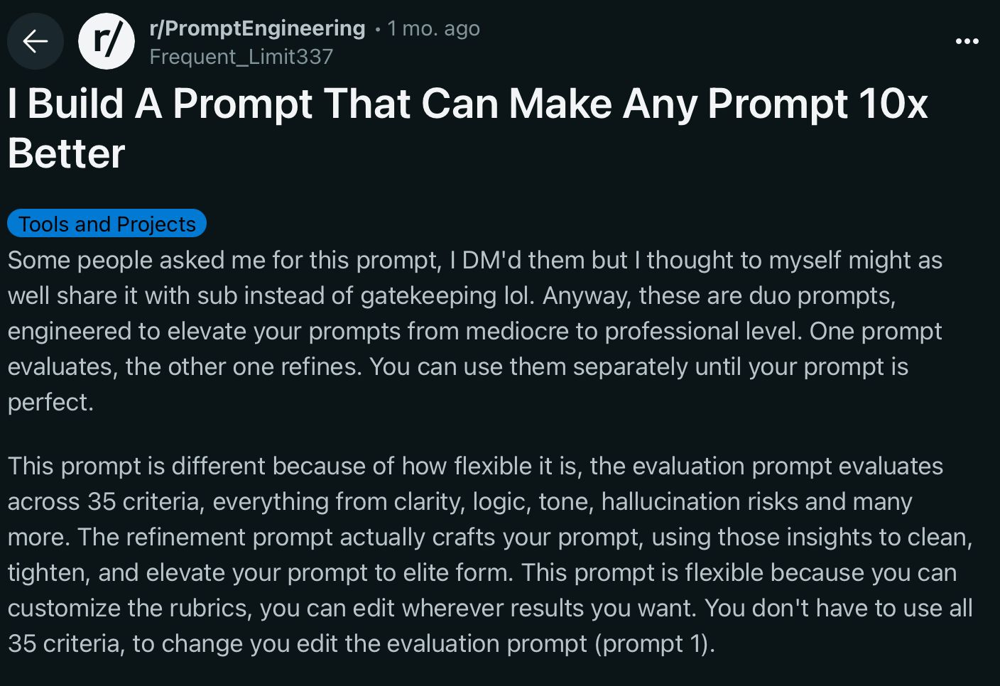

# Lessons Learned from One Year of Agentic Coding

*From tab completion to agents that present themselves*

<div class="pt-8">
  <div class="text-lg opacity-75">Jeronim Morina — @plattenschieber</div>
  <div class="text-sm opacity-50 mt-2">February 2026</div>
</div>

<div class="pt-12">
  <span @click="$slidev.nav.next" class="px-2 py-1 rounded cursor-pointer" hover="bg-white bg-opacity-10">
    Press Space for next slide <carbon:arrow-right class="inline"/>
  </span>
</div>

---

# 🧵 Worum geht's?

<v-click>

<div class="text-xl mb-6">
Vor einem Jahr habe ich angefangen, mit AI Coding Agents zu arbeiten.<br/>
Seitdem hat sich <strong>alles</strong> verändert — wie ich code, wie ich denke, wie ich arbeite.
</div>

</v-click>

<v-clicks>

<div class="grid grid-cols-3 gap-4 mb-6">

<div class="bg-gray-100 p-4 rounded-lg text-center">
<div class="text-3xl mb-2">🪨→⚔️</div>
<strong>Die Reise</strong><br/>
<span class="text-sm">Von Tab-Complete über Hype-Psychosis zu echten Durchbrüchen</span>
</div>

<div class="bg-gray-100 p-4 rounded-lg text-center">
<div class="text-3xl mb-2">💀→🪄</div>
<strong>Die Shifts</strong><br/>
<span class="text-sm">Death of the IDE. Agents die sich selbst präsentieren.</span>
</div>

<div class="bg-gray-100 p-4 rounded-lg text-center">
<div class="text-3xl mb-2">👤→🏢</div>
<strong>Der Weg nach vorn</strong><br/>
<span class="text-sm">Wie Teams und Organisationen jetzt mitziehen müssen</span>
</div>

</div>

</v-clicks>

<v-click>

<div class="bg-blue-50 p-4 rounded-lg">
<strong>Kein Sales Pitch. Keine Theorie.</strong> Nur was wirklich passiert ist — Wins, Fails, und die Patterns die überlebt haben.
</div>

</v-click>

---

# 📅 The Journey at a Glance

<div class="grid grid-cols-2 gap-4 text-sm">

<div>

<v-clicks>

<div class="bg-gray-100 p-2 rounded-lg mb-2">
<strong>Nov 2024</strong> — Cursor Tab Completion
</div>

<div class="bg-gray-100 p-2 rounded-lg mb-2">
<strong>Apr 2025</strong> — Claude Code. Everything changes.
</div>

<div class="bg-gray-100 p-2 rounded-lg mb-2">
<strong>Mai/Jun 2025</strong> — Spec-Driven Development
</div>

<div class="bg-gray-100 p-2 rounded-lg mb-2">
<strong>Aug 2025</strong> — Vibe Tunnel: Agent access from anywhere
</div>

<div class="bg-gray-100 p-2 rounded-lg mb-2">
<strong>Sep 2025</strong> — Claude Code Anonymous Round 1
</div>

</v-clicks>

</div>

<div>

<v-clicks>

<div class="bg-gray-100 p-2 rounded-lg mb-2">
<strong>Okt 2025</strong> — WhatsApp Relay. Voice coding from Morocco.
</div>

<div class="bg-gray-100 p-2 rounded-lg mb-2">
<strong>Dez 2025</strong> — Clawdbot: Always-on AI assistant
</div>

<div class="bg-gray-100 p-2 rounded-lg mb-2">
<strong>Jan 2026</strong> — Agent generates its own presentations
</div>

<div class="bg-gray-100 p-2 rounded-lg mb-2">
<strong>Feb 2026</strong> — OpenClaw. Agent presents itself at ClawCon.
</div>

<div class="bg-blue-100 p-2 rounded-lg mb-2">
<strong>Today</strong> — One year later. What did I learn?
</div>

</v-clicks>

</div>

</div>

---
layout: center
class: text-center
---

# Act 1
## Wie alles anfing

*Tab Tab Complete → erste Zweifel*

<div class="text-sm opacity-50 mt-4">November 2024</div>

---

# 🪨 The Stone Age: Tab Completion

<v-clicks>

<div class="bg-gray-50 p-4 rounded-lg mb-4">

### Der Workflow
1. Problem haben
2. ChatGPT fragen
3. Code kopieren
4. In Editor einfügen
5. Hoffen dass es funktioniert
6. Repeat

</div>

**Cursor, Copilot** — glorifiziertes Autocomplete

"Ich Tab-Tab-Complete mich durch den Tag"

</v-clicks>

<v-click>

<div class="bg-yellow-50 p-4 rounded-lg mt-6">
<strong>Das nagende Gefühl:</strong> "Ich verpasse irgendwas Größeres..."
</div>

</v-click>

---
layout: center
class: text-center
---

# Act 2
## Der Hype-Rausch & AI Psychosis

*Alles ausprobiert, nichts funktioniert*

<div class="text-sm opacity-50 mt-4">The ongoing disease</div>

---

# 🔥 The Reddit Rabbit Hole

<v-clicks>

<div class="grid grid-cols-2 gap-6">

<div>

### Was ich alles probiert habe

- **RIPER 5** (Research, Innovate, Plan, Execute, Review)
- Multiple Claude instances in tmux
- Complex git worktree setups
- Individual agents for each task
- "I Built A Prompt That Makes Any Prompt 10x Better"

</div>

<div>

### Was passiert ist

- 6 Design-Systeme parallel → alles stalled
- Credits verbrannt, nichts shipped
- Recovery unmöglich
- Zurück zu minimalistic HTML, one design at a time

</div>

</div>

</v-clicks>

<v-click>

<div class="text-center mt-4">

</div>

</v-click>

---

# 🧠 AI Psychosis

<v-click>

<div class="text-center text-2xl font-bold text-red-600 mb-8">
Der Zustand, wo du mehr Zeit mit Prompting verbringst als mit Denken.
</div>

</v-click>

<v-clicks>

**Symptome:**
- Du optimierst das Tool statt das Problem
- Du liest mehr über AI-Workflows als du shippst
- Du baust Prompts für Prompts
- Du reorganisierst deine AGENTS.md statt zu coden

</v-clicks>

<v-click>

<div class="bg-red-50 p-4 rounded-lg mt-6">
<strong>Die bittere Wahrheit:</strong> Es hat weniger mit der Magie der Prompts zu tun, als mit dir und deinem Verständnis des Problems.
</div>

</v-click>

<v-click>

<div class="bg-yellow-50 p-3 rounded-lg mt-3">
<strong>Honest moment:</strong> Wer hat sich schon mal dabei ertappt?
</div>

</v-click>

---
layout: center
class: text-center
---

# Act 3
## Die echten Durchbrüche

*Claude Code = Co-Founder, nicht Autocomplete*

<div class="text-sm opacity-50 mt-4">April – Juni 2025</div>

---

# ⚔️ The Iron Age: Claude Code

<v-click>

<div class="text-center text-2xl font-bold text-blue-600 mb-6">
April 2025: Alles ändert sich.
</div>

</v-click>

<v-clicks>

<div class="grid grid-cols-2 gap-6">

<div>

### Was anders war

- **Sonnet Qualitätssprung** — plötzlich vertrauenswürdig
- Kein Copy-Paste mehr
- Agent liest, denkt, handelt
- Fehler? Agent fixt sie selbst.

</div>

<div>

### Der Mindset-Shift

- Von "Code schreiben" → **"Intent formulieren"**
- Von "Tool nutzen" → **"Mit jemandem arbeiten"**
- Von "ich weiß was ich will" → **"lass uns rausfinden was ich will"**

</div>

</div>

</v-clicks>

<v-click>

<div class="bg-green-50 p-4 rounded-lg mt-6">
<strong>Es fühlte sich an wie ein Co-Founder.</strong> Einer der um 4 Uhr morgens noch da ist und nicht müde wird.
</div>

</v-click>

---

# 📝 Spec-Driven Development

<div class="text-sm opacity-50 mb-4">Mai/Juni 2025</div>

<v-click>

<div class="text-center text-2xl font-bold text-green-600 mb-6">
"Intent is the new source code"
</div>

</v-click>

<v-clicks>

<div class="grid grid-cols-3 gap-4">

<div class="bg-blue-50 p-4 rounded-lg">

### brainstorm.md
Raw ideas, unstrukturiert, alles raus aus dem Kopf

</div>

<div class="bg-purple-50 p-4 rounded-lg">

### spec.md
Crystal clear Requirements — was genau soll passieren?

</div>

<div class="bg-green-50 p-4 rounded-lg">

### tasks.md
Actionable Steps — Agent kann sofort loslegen

</div>

</div>

</v-clicks>

<v-click>

<div class="bg-green-100 p-4 rounded-lg mt-6">
<strong>Ergebnis:</strong> Nicht schneller bauen — das RICHTIGE bauen.
</div>

</v-click>

---

# 🏛️ The Socratic Approach

<v-clicks>

<div class="text-center mb-8">
<div class="text-2xl font-bold text-red-600">❌ Alter Weg</div>
<div class="text-lg mt-2">Ich → Prompt → AI → Code → Ich → Fix prompt → AI → Code</div>
</div>

<div class="text-center mb-8">
<div class="text-2xl font-bold text-green-600">✅ Neuer Weg</div>
<div class="text-lg mt-2">Ich → Vage Idee → AI fragt zurück → Ich kläre → AI VERSTEHT</div>
</div>

</v-clicks>

<v-click>

<div class="bg-blue-50 p-4 rounded-lg">
<strong>Das Model fragt DICH, nicht umgekehrt.</strong><br/>
Anthropic hat das später offiziell als "Plan Mode" eingebaut — wir haben's vorher schon so gemacht.
</div>

</v-click>

---

# ⚡ Flow State > Safety Theater

<v-click>

```bash
--dangerously-skip-permissions
```

</v-click>

<v-clicks>

<div class="mt-6">

**Die nervige Realität vorher:**
- "Can I read this file?" — Ja.
- "Can I search here?" — Ja.
- "Can I write this?" — JA VERDAMMT.

</div>

**Die Philosophie:**
> There's only a way forward, never backward.

</v-clicks>

<v-click>

<div class="bg-red-50 p-4 rounded-lg mt-4">
<div class="text-sm">
Tweet von @plattenschieber: "Meanwhile I'm using --dangerously-skip-permissions on most days 🤡🔫"
<br/><em>(Als Antwort auf Claude Code's "84% reduction in permission prompts")</em>
</div>
</div>

</v-click>

<v-click>

<div class="bg-yellow-50 p-3 rounded-lg mt-3">
<strong>Show of hands:</strong> Wer hat schon mal rage-quit wegen Permission Prompts?
</div>

</v-click>

---
layout: center
class: text-center
---

# Act 4
## The Death of the IDE

*IDEs sind für Menschen gebaut, nicht für Agents*

<div class="text-sm opacity-50 mt-4">February 2026</div>

---

# 💀 The Death of the IDE

<v-click>

<div class="bg-red-50 p-4 rounded-lg mb-6">
<strong>February 2026:</strong> Amp killed their IDE extension.<br/>
Sie haben erkannt: Extensions sind der falsche Ansatz.
</div>

</v-click>

<v-clicks>

### Was Agents wirklich brauchen

<div class="grid grid-cols-3 gap-4 mt-4">

<div class="bg-green-50 p-4 rounded-lg text-center">
<div class="text-4xl mb-2">📖</div>
<strong>Read</strong>
</div>

<div class="bg-green-50 p-4 rounded-lg text-center">
<div class="text-4xl mb-2">✏️</div>
<strong>Write</strong>
</div>

<div class="bg-green-50 p-4 rounded-lg text-center">
<div class="text-4xl mb-2">⚡</div>
<strong>Bash</strong>
</div>

</div>

Terminal, Filesystem, Git — keine Syntax-Highlighting-GUI.

</v-clicks>

<v-click>

<div class="bg-blue-50 p-4 rounded-lg mt-6">
<strong>Die IDE wird zum Viewer, nicht zum Editor.</strong><br/>
Du schaust dir an was der Agent gemacht hat. Du tippst nicht mehr selbst.
</div>

</v-click>

---

# 🏖️ Peter in Morocco

<v-click>

<div class="text-center mb-6">
<div class="text-2xl font-bold text-purple-600">
Voice Message via WhatsApp → Agent coded → Ergebnis zurück
</div>
</div>

</v-click>

<v-clicks>

**Peter Steinberger** (steipete) — Gründer von PSPDFKit, 200+ Mitarbeiter:

- Liegt am Pool in Marokko 🏖️
- Spricht eine Voice Message in WhatsApp
- Sein Agent (Clawdbot) empfängt, versteht, coded
- Ergebnis kommt als Nachricht zurück

**Kein Editor. Kein IDE. Kein Laptop aufklappen.**

Nur Intent.

</v-clicks>

<v-click>

<div class="bg-yellow-50 p-4 rounded-lg mt-4">
<strong>Das ist kein Zukunftsszenario.</strong> Das passiert jetzt. Seit Oktober 2025.
</div>

</v-click>

---
layout: center
class: text-center
---

# Act 5
## How Agents Actually Evolved

*Von Bash-Scripts zu Infrastruktur*

---

# 🦞 The Evolution of Agents

<v-clicks>

<div class="space-y-4">

<div class="bg-gray-100 p-4 rounded-lg flex items-center gap-4">
<div class="text-3xl">🔧</div>
<div>
<strong>Bash + Read + Write</strong> — Die Primitives. Mehr braucht ein Agent nicht.<br/>
<span class="text-sm opacity-75">Beispiel: Amp selbst gebaut mit nur diesen 3 Operationen</span>
</div>
</div>

<div class="text-center text-2xl">↓</div>

<div class="bg-blue-50 p-4 rounded-lg flex items-center gap-4">
<div class="text-3xl">⚡</div>
<div>
<strong>Claude Code CLI</strong> — Agent mit echten Tools. Terminal, Git, Tests.<br/>
<span class="text-sm opacity-75">April 2025</span>
</div>
</div>

<div class="text-center text-2xl">↓</div>

<div class="bg-purple-50 p-4 rounded-lg flex items-center gap-4">
<div class="text-3xl">🦞</div>
<div>
<strong>Always-on Services</strong> — Clawdbot → Moltbot → OpenClaw<br/>
<span class="text-sm opacity-75">WhatsApp, Telegram, Cron, Second Brain, Browser — Dez 2025 bis heute</span>
</div>
</div>

<div class="text-center text-2xl">↓</div>

<div class="bg-green-50 p-4 rounded-lg flex items-center gap-4">
<div class="text-3xl">🏢</div>
<div>
<strong>Enterprise Agents</strong> — Managed Platforms, Token Rotation, Team-Infrastruktur<br/>
<span class="text-sm opacity-75">Die Zukunft für Unternehmen</span>
</div>
</div>

</div>

</v-clicks>

---

# 🪄 Agent Generates Its Own Presentation

<div class="text-sm opacity-50 mb-4">January 13, 2026</div>

<v-clicks>

<div class="bg-purple-50 p-4 rounded-lg mb-4">
<strong>Alfred</strong> (mein Agent) hat die Slides für Claude Code Anonymous Round 4 selbst geschrieben.
<br/>Repo: <code>github.com/plattenschieber/agent-presentation</code>
</div>

**Aber es wurde noch besser:**

<div class="bg-green-50 p-4 rounded-lg mb-4">
<strong>10. Februar 2026 — ClawCon:</strong><br/>
Alfred hat nicht nur die Präsentation erstellt — <strong>er hat sich selbst präsentiert.</strong>
<br/>Live-Demo vor Publikum. Der Agent steuert die Slides, öffnet den Browser, zeigt seine eigenen Features.
<br/>Repo: <code>github.com/bloomedai/clawcon-presentation</code>
</div>

</v-clicks>

<v-click>

<div class="bg-yellow-50 p-4 rounded-lg">
<strong>🎭 Inception:</strong> Ein Agent der eine Präsentation über Agents hält, die von einem Agent erstellt wurde.
</div>

</v-click>

---
layout: center
class: text-center
---

# Act 6
## How to Move Forward as a Company

*Knowledge muss fließen*

---

# 📚 The Knowledge Flow Problem

<v-click>

<div class="text-center text-2xl font-bold text-red-600 mb-8">
Jede Erkenntnis die in deinem lokalen Repo bleibt,<br/>ist für die Organisation verloren.
</div>

</v-click>

<v-clicks>

<div class="space-y-4">

<div class="bg-blue-50 p-4 rounded-lg flex items-center gap-4">
<div class="text-3xl">👤</div>
<div>
<strong>CLAUDE.md</strong> — Persönliches Repo<br/>
<span class="text-sm">Entwickler lernt etwas → schreibt es auf → Agent liest es beim nächsten Mal</span>
</div>
</div>

<div class="text-center text-2xl">↓</div>

<div class="bg-purple-50 p-4 rounded-lg flex items-center gap-4">
<div class="text-3xl">👥</div>
<div>
<strong>Team-CLAUDE.md</strong> — Shared Repo / Monorepo Root<br/>
<span class="text-sm">Best Practices, Conventions, "So machen wir das hier"</span>
</div>
</div>

<div class="text-center text-2xl">↓</div>

<div class="bg-green-50 p-4 rounded-lg flex items-center gap-4">
<div class="text-3xl">🏢</div>
<div>
<strong>Abteilungs-CLAUDE.md</strong> — Org-wide Patterns<br/>
<span class="text-sm">Security Rules, Architecture Decisions, Compliance — für alle Teams</span>
</div>
</div>

</div>

</v-clicks>

---

# 🔄 CLAUDE.md als lebende Dokumentation

<v-clicks>

<div class="grid grid-cols-2 gap-6">

<div>

### ❌ Alter Weg

- Confluence-Seite geschrieben
- Niemand liest sie
- Veraltet nach 2 Wochen
- Wissen stirbt still

</div>

<div>

### ✅ Neuer Weg

- **Code-nah**: Direkt im Repo
- **Agent-lesbar**: Markdown, klar strukturiert
- **Versioniert**: Git History zeigt Evolution
- **Lebendig**: Wird bei jedem Commit besser

</div>

</div>

</v-clicks>

<v-click>

<div class="bg-blue-50 p-4 rounded-lg mt-6">
<strong>Convention over Configuration</strong><br/>
Die Rails-Philosophie für AI-Teams: Starke Defaults, weniger Entscheidungen, mehr Fokus.
</div>

</v-click>

<v-click>

<div class="bg-green-50 p-4 rounded-lg mt-4">
<strong>Das ist der neue Knowledge-Management-Prozess:</strong><br/>
Nicht Wiki. Nicht Confluence. Dort wo der Agent es liest.
</div>

</v-click>

---

# ✅ Patterns That Stuck vs. ❌ Patterns That Died

<div class="grid grid-cols-2 gap-6 text-sm">

<div>

### ✅ Kept

<v-clicks>

<div class="bg-green-50 p-2 rounded-lg mb-2">
<strong>Intuition entwickeln</strong> — Du FÜHLST wenn das Model struggelt
</div>

<div class="bg-green-50 p-2 rounded-lg mb-2">
<strong>Blast Radius Thinking</strong> — Scope verstehen vor Execution
</div>

<div class="bg-green-50 p-2 rounded-lg mb-2">
<strong>Parallele Terminals</strong> — 3-8 Fenster > elaborate Setups
</div>

<div class="bg-green-50 p-2 rounded-lg mb-2">
<strong>Skills (Markdown)</strong> — On-demand, composable, portable
</div>

<div class="bg-green-50 p-2 rounded-lg mb-2">
<strong>Ralph Wiggum Loop</strong> — Fresh context per iteration
</div>

<div class="bg-green-50 p-2 rounded-lg mb-2">
<strong>Commit to main</strong> — PRs nur für Big Features
</div>

</v-clicks>

</div>

<div>

### ❌ Killed

<v-clicks>

<div class="bg-red-50 p-2 rounded-lg mb-2">
<strong>"You are an expert..."</strong> — Persona-Prompts helfen nicht
</div>

<div class="bg-red-50 p-2 rounded-lg mb-2">
<strong>Elaborate System Prompts</strong> — "Context Poison"
</div>

<div class="bg-red-50 p-2 rounded-lg mb-2">
<strong>Subagent-Orchestrierung</strong> — Manuelle Fenster sind besser
</div>

<div class="bg-red-50 p-2 rounded-lg mb-2">
<strong>MCPs</strong> — "Context Tax" wenn CLIs reichen
</div>

<div class="bg-red-50 p-2 rounded-lg mb-2">
<strong>Lange Sessions</strong> — Context Rot ist real
</div>

<div class="bg-red-50 p-2 rounded-lg mb-2">
<strong>Feature Branches solo</strong> — Overhead ohne Mehrwert
</div>

</v-clicks>

</div>

</div>

---
layout: center
class: text-center
---

# Die 3 Takes

<v-clicks>

<div class="text-3xl font-bold text-blue-600 mb-8">
1. Intent > Code
</div>

<div class="text-lg mb-12 opacity-75">
Hör auf zu tippen. Fang an zu formulieren.
</div>

<div class="text-3xl font-bold text-green-600 mb-8">
2. Simplicity > Complexity
</div>

<div class="text-lg mb-12 opacity-75">
Alles was funktioniert hat, kam durch Weglassen.
</div>

<div class="text-3xl font-bold text-purple-600 mb-8">
3. Knowledge must flow
</div>

<div class="text-lg opacity-75">
CLAUDE.md: Lokal → Team → Organisation
</div>

</v-clicks>

---
layout: center
class: text-center
---

# Diskussion 🎤

<v-click>

<div class="grid grid-cols-3 gap-4 text-lg mt-8">
  <div class="p-4 bg-blue-50 rounded-lg">
    Wo steht ihr auf<br/>der Journey?
  </div>
  <div class="p-4 bg-yellow-50 rounded-lg">
    Was habt ihr<br/>still aufgegeben?
  </div>
  <div class="p-4 bg-green-50 rounded-lg">
    Wie fließt Wissen<br/>in eurer Org?
  </div>
</div>

</v-click>

<v-click>

<div class="mt-12 text-xl">
<strong>Jeronim Morina</strong> — @plattenschieber
</div>

</v-click>

<div class="absolute bottom-10 left-10">
<small>Slides: github.com/plattenschieber/agent-presentation</small>
</div>
