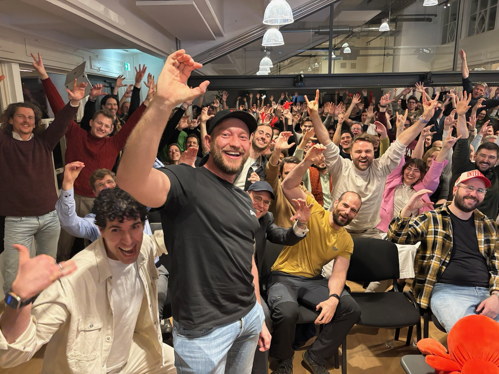

# Sokrates — Company OS
## Not another chatbot. An operational system for real team work.

  
Jeronim Morina + Team Brynk

  
ClawCon NRW — 5-minute lightning talk

  
    Press Space for next slide <carbon:arrow-right class="inline"/>
  

---

# Who am I — and why should you listen to me?
## Somehow I ended up on that photo.

<v-clicks>

Peter Steinberger — yes, the guy who went to OpenAI — invited me to ClawCon Vienna.

I got to present <strong>brain-cli</strong>, which later even made it into the official OpenClaw docs.

And somehow I ended up on <em>that</em> group photo in his article. So now I guess I have to earn it.

</v-clicks>

---

# The Problem
## AI is useful individually. Chaotic collectively.

<v-clicks>

<strong>Today:</strong> everyone has their own Claude or ChatGPT tab.

<strong>Result:</strong> prompts, outputs, and decisions stay trapped in private workflows.

<strong>Consequence:</strong> teams get smarter tools — but not coherent execution.

</v-clicks>

---

# The Thesis
## Companies need more than AI tools. They need a Company OS.

<v-clicks>

A system that connects <strong>context</strong>, <strong>roles</strong>, <strong>tools</strong>, and <strong>execution</strong>.

A system where good ideas do not die in chat threads, docs, or tabs.

That is what Sokrates is for us.

</v-clicks>

---

# What Sokrates Is
## Built on OpenClaw. Designed for real work.

<v-clicks>

<strong>Memory</strong> 
Persistent context across people, projects, and decisions

<strong>Skills</strong> 
Reusable capabilities for repeatable workflows

<strong>Integrations</strong> 
Messaging, repos, browser automation, previews, docs

</v-clicks>

<v-clicks>

<strong>Boards + structure</strong> 
Execution that does not dissolve into chat chaos

<strong>Channel-native interaction</strong> 
The team works where it already works

<strong>Operational AI</strong> 
Not just answers — actions through real systems

</v-clicks>

---

# Why It Feels Different
## The point is not better text. The point is coordinated execution.

### Typical AI workflow

<v-clicks>

- ask model
- get output
- copy somewhere else
- hope someone follows through

</v-clicks>

### Sokrates workflow

<v-clicks>

- ask in the team channel
- context comes with the request
- right skill executes
- result returns to the loop

</v-clicks>

<v-click>

<strong>Claim:</strong> team intent can move directly into coordinated execution.

</v-click>

---

# The Team Layer
## AI with role awareness

<v-clicks>

We work with a 5-dimensional leadership model: Apostle, Prophet, Teacher, Evangelist, Pastor.

Sokrates does not just understand the task. It also helps map the task to the right role and owner.

That turns AI from individual helper into team coordination infrastructure.

</v-clicks>

---

# What The Same System Can Do
## Different outputs. One operating model.

<v-clicks>

<strong>Landing page iteration</strong> 
WhatsApp feedback → repo change → PR → preview

<strong>StoryBrand / messaging work</strong> 
Framework-guided artifacts with project context

<strong>Bug capture</strong> 
Testing insight → board entry → prioritization

</v-clicks>

<v-clicks>

<strong>Knowledge continuity</strong> 
Memory across sessions, people, and projects

<strong>Operational integrations</strong> 
Files, browser, repos, docs, messaging surfaces

<strong>Omaship</strong> 
The product and deployment backbone for shipping secure company systems like this

</v-clicks>

---

# Live Demo
## One WhatsApp message. Real execution.

<strong>Prompt on the slide:</strong>  
“@sokrates Bitte überarbeite die MedicalDocu-Landingpage: 
1. Stelle Vertrauen und medizinische Qualität stärker in den Vordergrund als reine Automatisierung. 
2. Passe den Hero so an, dass klar wird: weniger Dokumentationsaufwand ist das Ergebnis von besserer Qualität. 
3. Füge direkt unter dem Hero eine Trust-Leiste ein mit: gemeinsam mit Ärzt:innen entwickelt, deutsche medizinische Fachsprache, Arzt bleibt Autor, DSGVO-konform. 
4. Erstelle daraus einen PR mit Preview-Link.”

<v-click>

No prompt-theater. No special UI. Just language, context, and a real task moving through the system.

</v-click>

---

# The Bigger Bet
## We are building Brynk through the system.

<v-clicks>

We are not just using Sokrates to support Brynk AI.

We are building Brynk AI through Sokrates as a Company OS.

With Omaship, this becomes a product path: build, deploy, and scale secure company operating systems and the apps around them.

</v-clicks>

---
layout: center
class: text-center
---

# Try The Backbone

### Omaship

<v-clicks>

<strong>What it is</strong> 
The backbone for deploying and operating secure company systems

<strong>Why it matters</strong> 
If Sokrates is the Company OS, Omaship is the infrastructure that makes it shippable

<strong>CTA</strong> 
Scan the QR code and try the product

</v-clicks>

  

    
    
<strong>omaship.com</strong>

  

---
layout: center
class: text-center
---

# The Thesis

Sokrates is our Company OS.

It connects people, memory, tools, roles, and execution.

<v-click>

Not AI for isolated individuals. 
AI for coherent team action.

</v-click>
